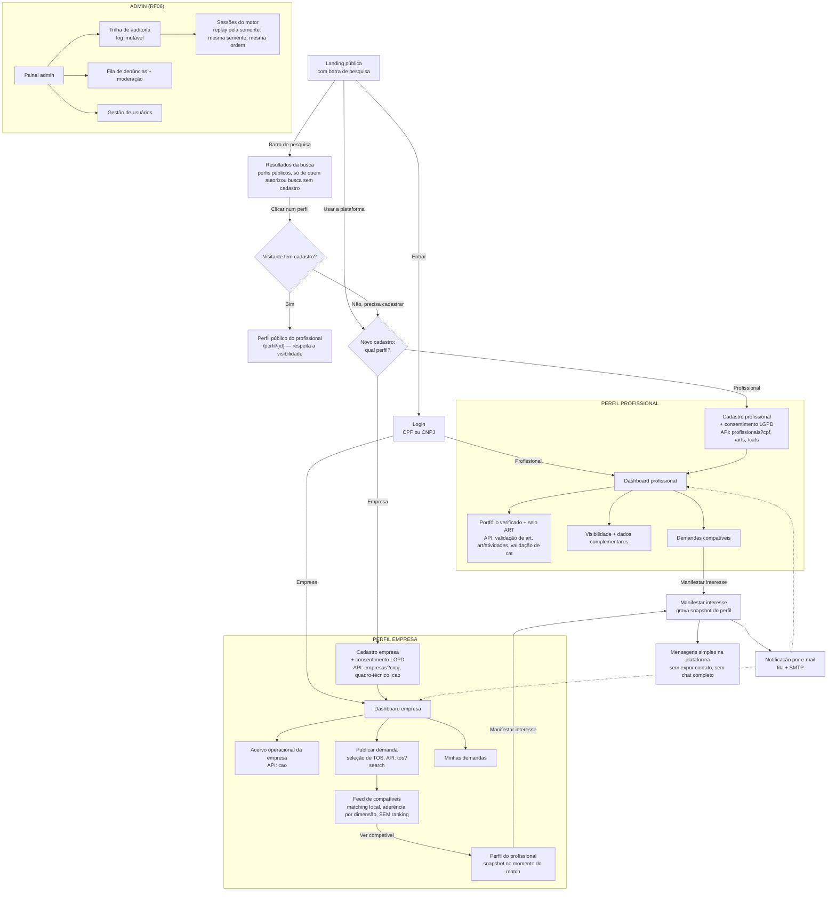

# Fluxos

O caminho completo da aplicação, tela a tela. Cada bloco é uma tela, cada seta uma ação, e a nota
diz qual chamada de API dispara ali. Serve para ver o todo antes de construir cada template e para
amarrar os seis cenários do Anexo I (item 7) a um caminho concreto. Em que etapa cada cenário
destrava está no `backlog.md`; os endpoints, em `endpoints.md`; o motor, em `matching.md`; o visual
de cada tela, em `design.md`.

**Legenda:** seta cheia = navegação por ação do usuário; seta pontilhada = notificação automática.

**Cobertura da API.** Os 10 endpoints estão amarrados a alguma tela: `profissionais`/`arts`/`cats`
no perfil do profissional; `empresas`/`quadro-técnico`/`cao` no perfil da empresa; `tos` na
demanda; validação de `arts`/`cats` no selo. Nenhuma varredura — a consulta é sempre pelo cadastro
do candidato (item 10.4).

## Fluxos críticos vs. não-críticos

O diferencial que fica visível na documentação e no vídeo: separar o que **toca a API oficial ou
grava/altera dado** do que é só leitura. É onde a revisão de segurança da E7 concentra o esforço.

- **Críticos** — autenticação (login/cadastro), validação de ART/CAT pela API (o selo), escrita no
  histórico/acervo (importação, associação de ART, herança pelo CAO), manifestação com snapshot,
  e moderação (bloqueio/denúncia). São transacionais e auditados.
- **Não-críticos** — busca pública, ver perfil público, visualização do feed, notificação por
  e-mail. Falha aqui degrada a experiência, não a integridade.

## Estados fora do caminho feliz

O diagrama acima é o caminho feliz. Estes são os desvios que o design cobre de propósito, porque
cada um toca um fluxo crítico (a degradação digna é parte do diferencial de segurança):

- **Registro não validado** — no cadastro do profissional a API não respondeu
  (`profissionais?cpf` indisponível). A conta é criada, o perfil não aparece para ninguém, e a
  tela do perfil oferece a única saída: "Validar meu registro". Estado recuperável, tom
  informativo, sem culpar o usuário.
- **Acervo não importado** — registro validado, mas a importação de ARTs falhou no meio.
  Mesmo padrão: "Importar minhas ARTs".
- **Selo divergente** — a exibição do portfólio recalcula o HMAC de cada ART e compara com o
  hash gravado. Quando não confere, o selo daquela ART é **suspenso** (símbolo âmbar de
  integridade, nunca o selo verde intacto), a divergência entra na trilha de auditoria e a saída
  é "Revalidar na API". É o estado mais grave: alerta de integridade, não erro do usuário.
- **Perfil em construção** — menos ARTs que `match.early_career.min_arts`. O profissional
  **nunca sai do pool**; a marca é contextual (neutra, junto do acervo) no feed e no perfil, e a
  busca ativa ganha o filtro "incluir perfis em construção", desligado por padrão. Mitigação de
  viés declarada na entrega (12.3).
- **Sem nenhuma ART registrada** — o limite honesto do anterior. O motor cruza a demanda com a
  evidência, e evidência vem de ART: com zero ARTs não há o que cruzar, o score na dimensão de
  competência é nulo e o perfil fica abaixo do limiar. Ele **não aparece em feed nenhum**, e
  continua encontrável na busca ativa por nome e modalidade, que não dependem de acervo. É
  limitação declarada, não defeito: recomendar quem não tem evidência contrariaria a tese de
  evidência documental do projeto. Ver D33.

Hierarquia de cor desses estados (regra de design): **âmbar = só integridade/divergência**;
azul-info neutro = estado recuperável de sincronização; vermelho = só destrutivo/bloqueio.

## Os seis cenários (Anexo I, item 7) no fluxo

O `backlog.md` diz em que etapa cada um destrava; aqui, o caminho:

1. **Profissional cria perfil e vê acervo com selo** — CADP → DASHP → PORT (destrava na E2).
2. **Empresa publica demanda** — CADE → DASHE → PUBD (E3).
3. **Compatibilização** — PUBD → FEEDE, card abre a explicação por dimensão, sem ranking (E4).
4. **Manifestação e a empresa vê o perfil** — FEEDP/PERFV → MANIF → COMM/NOTIF (E5).
5. **Correção e denúncia** — VISP + denúncia; ADM → AUD/DEN (E6).
6. **Admin vê auditoria e modera** — ADM → AUD → DEN, bloqueio (E6).
